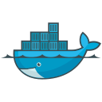

# DevSecOps: OpenAI Chatbot UI Deployment in EKS with Jenkins and Terraform
## 🏗️ Project Architecture :


---

## 📋 Project Overview

A modern ChatBot UI application deployed using a comprehensive DevSecOps pipeline. This project demonstrates the implementation of security-first CI/CD practices, infrastructure as code, and cloud-native technologies.
This ChatBot App hadn't been develop by me, just check this repo to find the author : [Chatbot-UI](https://github.com/mckaywrigley/chatbot-ui)

## 🔒 Security Features

- Infrastructure security with AWS Security Groups
- Container security scanning with Trivy
- Code quality gates with SonarQube
- Dependency vulnerability checking
- Secure Docker image management
- Kubernetes security best practices

## 🛠️ Technology Stack

> Tools, languages, and other things that have been used.

<table>
  <tr>
    <td align="center" width="96">
      <a href="#macropower-tech">
        
      </a>
      <br>Terraform
    </td>
    <td align="center" width="96">
      <a href="#macropower-tech">
        
      </a>
      <br>Jenkins
    </td>
    <td align="center" width="96">
      <a href="#macropower-tech">
        
      </a>
      <br>Git
    </td>
    <td align="center" width="96">
      <a href="#macropower-tech">
        
      </a>
      <br>AWS
    </td>
    <td align="center" width="96">
      <a href="#macropower-tech">
        
      </a>
      <br>DynamoDB
    </td>
    <td align="center" width="96">
      <a href="#macropower-tech">
        
      </a>
      <br>React
    </td>
    <td align="center" width="96">
      <a href="#macropower-tech">
        
      </a>
      <br>SonarQube
    </td>
    <td align="center" width="96">
      <a href="#macropower-tech" >
        
      </a>
      <br>Kubernetes
    </td>
    <td align="center" width="96"> 
      <a href="#macropower-tech" >
        
      </a>
      <br>Docker
    </td>
    <td align="center"  width="96">
      <a href="#macropower-tech">
        
      </a>
      <br>Ubuntu
    </td>
    <td align="center" width="96">
      <a href="#macropower-tech" >
        
      </a>
      <br>Node.js
    </td>
    <td align="center" width="96">
      <a href="#macropower-tech" >
        
      </a>
      <br>VSCode
    </td>
    <td align="center" width="96">
      <a href="#macropower-tech" >
        
      </a>
      <br>Trivy
    </td>
  </tr>
</table>


## 📝 Prerequisites

- AWS Account
- Docker Hub Account
- Jenkins installed on EC2 Instance Server
- Java 17 installed
- Node.js 19 installed
- Docker installed
- Git installed
- Trivy installed
- OWASP Dependency Check installed
- kubectl configured
- AWS CLI configured

## 🔧 Setup Instructions

1. Clone the repository

   ```bash
   git clone https://github.com/dimognetehem/OpenAI-ChatBot-UI.git
   ```

2. Deploy Infrastructure

   ```bash
   cd Jenkins-Server-TF
   ```
   
   ```bash
   terraform init
   terraform validate
   ```


   ```bash
   terraform plan
   terraform apply
   ```


3. Connecting to instance via SSH

 - Already set a bash script in the EC2 instance's user data to install required tools (like Jenkins, Git, Java, Docker, etc.)


4. Configure Jenkins


   - Install required plugins
    Navigate to Manage Jenkins → Plugins → Available Plugins and install the following :


    ```go
    1 → Eclipse Temurin Installer

    2 → SonarQube Scanner

    3 → NodeJs Plugin

    4 → Docker

    5 → Docker commons

    6 → Docker pipeline

    7 → Docker API

    8 → Docker Build step

    9 → Owasp Dependency Check

    10 → Kubernetes

    11 → Kubernetes CLI

    12 → Kubernetes Client API

    13 → Kubernetes Pipeline DevOps steps

    14 → AWS Credentials

    15 → Pipeline: AWS Steps
    ```
    


   - Set up pipeline


   - Configure credentials


5. Configure SonarQube

   ```groovy
   Default-Credentials
   Username : admin
   Password : admin
   ```


6. Launching Pipeline Build

   - Build Success !


7. SonarQube Scan Analysis

   - Passed !


8. Chatbot-UI App Deployed !


9. Creating API Key on OpenAI


10. Testing the app


It's Done !

## 📈 Future Improvements

- [ ] Implement GitOps practices
- [ ] Add monitoring and observability (Prometheus and Grafana)
- [ ] Enhance security scanning
- [ ] Implement auto-scaling
- [ ] Add disaster recovery

## 🤝 Contributing

Contributions are welcome! Please feel free to submit a Pull Request.

## 📄 License

This project is licensed under the MIT License - see the LICENSE file for details.

## 👤 Author

- **DIMOGNE TEHEM Emmanuel Franck**
- Role: DevOps/Software Engineer
- [GitHub](https://github.com/dimognetehem)

---
*This project was developed as part of a DevOps portfolio demonstration, showcasing modern cloud-native security practices and automation.*


